# FleetOps: ETS2 Active Fleet Intelligence & Observability Engine


---

## Why Euro Truck Simulator 2?

You might wonder why a fleet management observability project is built on top of a video game. The answer lies in the incredible difficulty of obtaining raw, high-frequency telemetry data from real-world enterprise fleets without expensive hardware and legal barriers.

Euro Truck Simulator 2 (ETS2) provides a uniquely hyper-realistic physics engine that acts as a perfect digital twin for enterprise logistics. By hooking into the ETS2 memory structure, we gain access to real-time equivalents of:
- **CAN-bus vehicle data** (engine RPM, active gear, retarder steps, fuel consumption in liters, brake temperature).
- **High-frequency GPS and Inertial Measurement Units (IMU)** (3D placement, acceleration vectors, sway angles, and pitch).
- **Logistics job management** (source, destination, income, payload, and remaining distance).

This makes ETS2 the perfect sandbox to demonstrate a real-world use case for SigNoz: ingesting massive volumes of raw sensor data and analyzing it in real-time to generate actionable business intelligence.

---

## Overview

FleetOps is an advanced telemetry ingestion and analysis daemon that bridges the gap between simulated physics environments and enterprise observability. By hooking into the **Euro Truck Simulator 2 Telemetry Server**, FleetOps extracts high-frequency vehicle physics data (RPM, G-Forces, Sway Angles, Pitch) and structures them into **OpenTelemetry (OTLP)** metrics, traces, and logs.

This data is streamed in real-time to a local **SigNoz** instance, where custom **ClickHouse SQL dashboards and alerts** actively monitor driver behavior, predict SLA breaches, track component degradation, and catch extremely dangerous driving maneuvers (like Jackknifing and Harsh Braking) the moment they happen.

---

## Key Features & Architecture

### 1. Real-Time Telemetry Logs (The "Tick")
Instead of relying purely on 60-second aggregated metrics, FleetOps streams a high-frequency `telemetry_tick` structured log every 0.5s. This allows the SigNoz dashboard to render live, near-instantaneous telemetry (Speed, Fuel, Gear, RPM, Cruise Control) using lightning-fast ClickHouse queries (`signoz_logs.distributed_logs_v2`), bypassing traditional metric aggregation latency.

### 2. Advanced Safety Physics Engine
The `EventDetector` continuously analyzes raw 3D vectors (`acceleration_x/y/z`, `placement`, `pitch`) to detect critical safety violations:
- **Harsh Braking (G-Force):** Detects abrupt braking > `4.5 m/s²`.
- **Dangerous Cornering:** Detects lateral G-force > `3.0 m/s²` at high speeds.
- **Jackknife Risk:** Monitors the angle between the truck cab and trailer.
- **Grade-Aware Braking:** Detects abuse of service brakes on steep descents without engine retarders.

### 3. Trace-Based Job Lifecycle (SLA Tracking)
Every delivery job is treated as a **Distributed Trace**. 
- The root span represents the entire delivery journey.
- Attributes (Source, Destination, Income, Wasted Mileage) are recorded precisely upon job completion (`job.income > 0`).
- **Span Events** are injected directly into the trace timeline whenever a safety violation (like speeding) occurs, acting as "red diamond" incident markers along the route.

### 4. Intelligent Teleportation (Ferry) Handling
Using 3D displacement vectors, the system detects when a truck is loaded onto a ferry or Eurotunnel train (traveling > 50km in 0.5s). Instead of triggering massive speeding alerts or corrupting mileage data, it injects a clean `fleet.transport.ferry` event into the trace timeline.

### 5. Instant Alertmanager Webhooks (`For = 0m`)
SigNoz Threshold Alerts are configured to fire *instantly* (`Match duration = 0m`). If a driver jackknifes or speeds, the dispatcher (via Webhook) receives a `firing` payload immediately, and a `resolved` payload the exact second the driver regains control.

---

## Tech Stack

*   **Telemetry Daemon:** Python 3.10+, `opentelemetry-sdk`, `requests`
*   **Observability Backend:** SigNoz (v3/v4 schema)
*   **Data Store:** ClickHouse (`distributed_logs_v2`, `distributed_signoz_index_v3`)
*   **Deployment:** `foundryctl` (SigNoz Foundry), Docker Compose

---

## Getting Started

### 1. Prerequisites
*   Euro Truck Simulator 2 (ETS2)
*   ETS2 Telemetry Server (provided in the `telemetry-server/` directory of this repository) running on `localhost:25555`
*   Docker & Docker Compose

### 2. Deploy SigNoz
We use SigNoz Foundry to spin up the observability backend. Follow the official [Foundry Quickstart](https://signoz.io/docs/install/docker/):

```bash
# 1. Install foundryctl (macOS / Linux)
curl -sL https://signoz.io/install.sh | bash

# 2. Deploy the SigNoz stack using our custom configuration
foundryctl cast -f casting.yaml
```
*(Note: `mcp: enabled: true` is explicitly configured in `casting.yaml` to ensure the OTel Ingester receives its pipeline configuration correctly).*

### 3. Start the ETS2 Telemetry Server
Before running the daemon, you must start the telemetry server bridge.
1. Launch Euro Truck Simulator 2 (ETS2).
2. Navigate to the `telemetry-server/server/` directory in this repository.
3. Run the `Ets2Telemetry.exe` executable.
4. Ensure it successfully connects to the game simulator.

### 4. Start the FleetOps Daemon
```bash
# Create a virtual environment
python -m venv .venv
source .venv/Scripts/activate

# Install dependencies
pip install opentelemetry-api opentelemetry-sdk opentelemetry-exporter-otlp requests

# Run the daemon
python -m ets2_fleetops.main
```

### 5. Import Dashboards
Navigate to your SigNoz UI (`http://localhost:3301`) -> **Dashboards** -> **Import JSON**.
Upload the `FleetOps_Dashboard.json` located in the `dashboards/` directory of this repository.

---

## Dashboard SQL Snippets

We leverage direct ClickHouse SQL in SigNoz for our advanced panels. Here is an example of our **Journey Summary Leaderboard**:

```sql
SELECT
    attributes_string['ets2.job.source_city'] as `Start City`,
    attributes_string['ets2.job.destination_city'] as `Destination`,
    round(attributes_number['ets2.job.duration_seconds'] / 60, 1) as `Time (Min)`,
    round(attributes_number['ets2.job.fuel_used'], 1) as `Fuel Used (L)`,
    round(attributes_number['ets2.job.wasted_mileage_km'], 1) as `Wasted KM`,
    attributes_number['ets2.job.income'] as `Income (€)`
FROM signoz_traces.distributed_signoz_index_v3
WHERE serviceName = 'fleetops-ets2'
  AND name LIKE 'Delivery:%'
ORDER BY timestamp DESC
LIMIT 10
```

---

## Screenshots & Demos

### 1. The FleetOps Master Dashboard
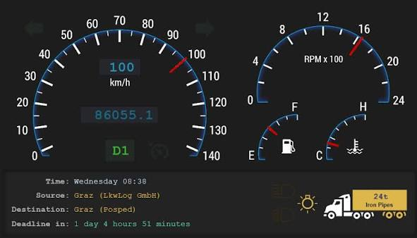

### 2. Trace Waterfall View (Delivery Job)
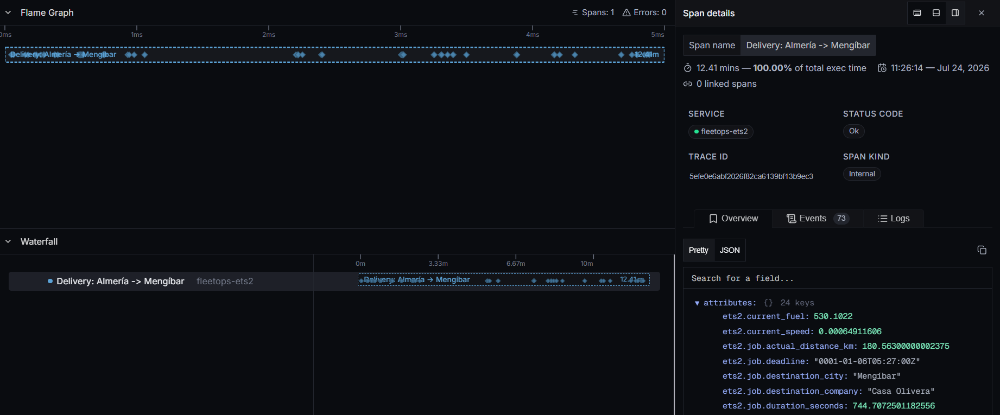

### 3. Active Safety Alerts
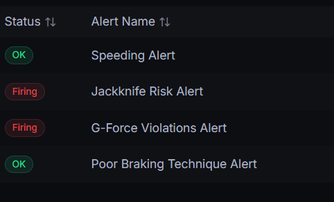

### 4. Journey Summary Leaderboard
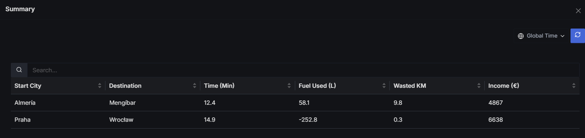

### Individual Dashboard Panels

<p align="center">
  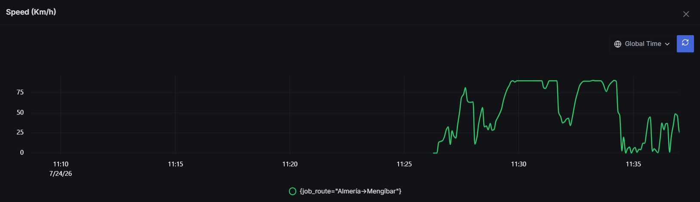
  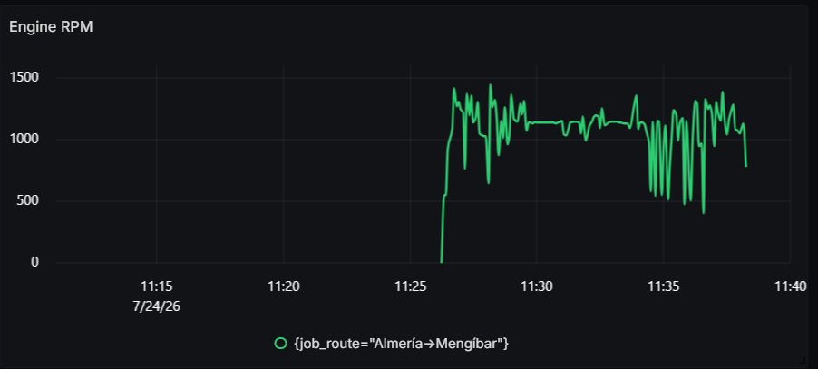
</p>
<p align="center">
  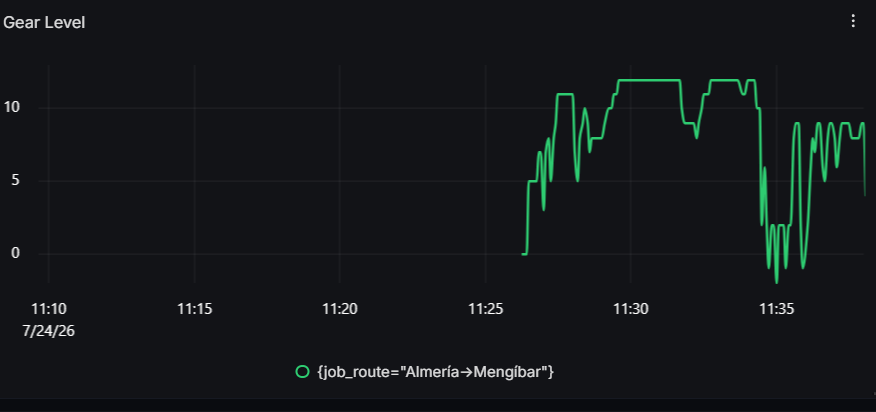
  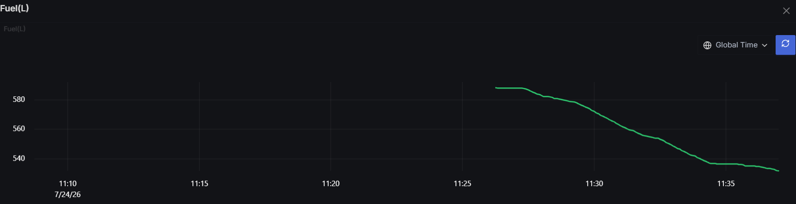
</p>
<p align="center">
  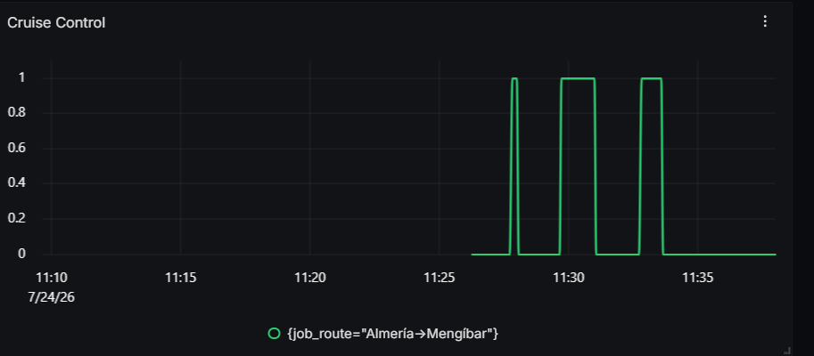
  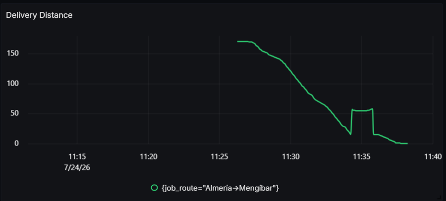
</p>
<p align="center">
  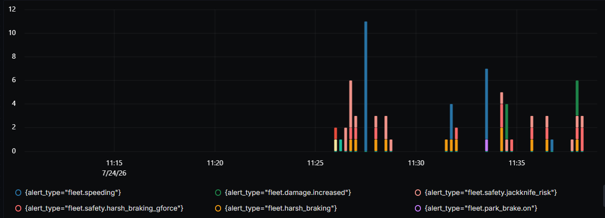
  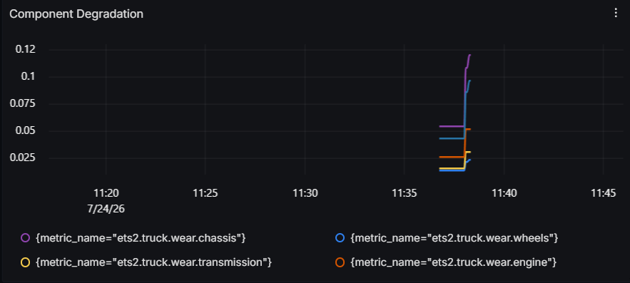
</p>
<p align="center">
  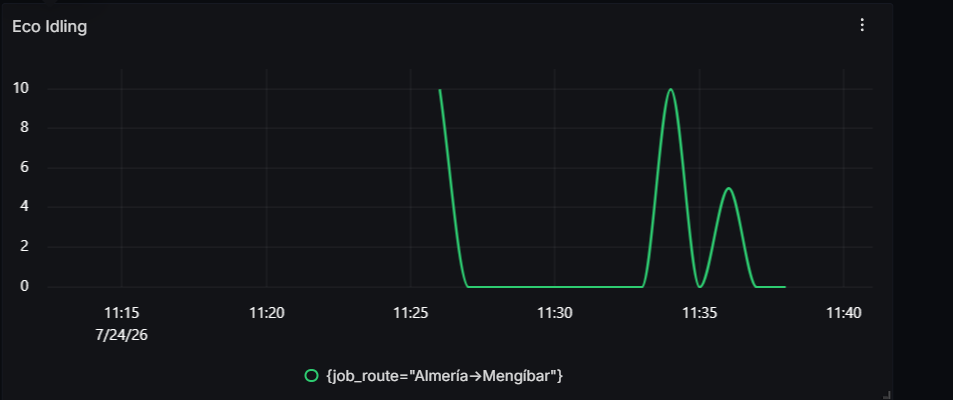
  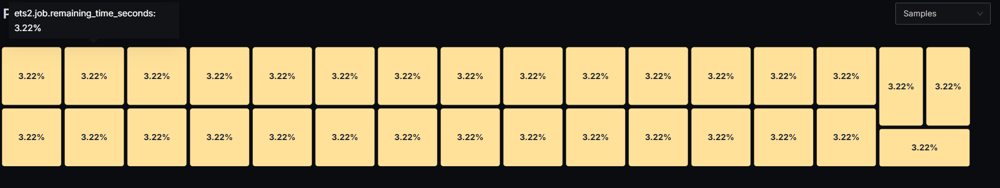
</p>

---

## Acknowledgments
A massive thank you to **SCS Software** for providing the underlying telemetry SDK capabilities within ETS2, and to **Funbit** for creating the exceptional `ets2-telemetry-server` that made this physics data accessible over a REST/WebSocket API.

---

## License
This project is submitted for the SigNoz Hackathon. Licensed under the MIT License.
